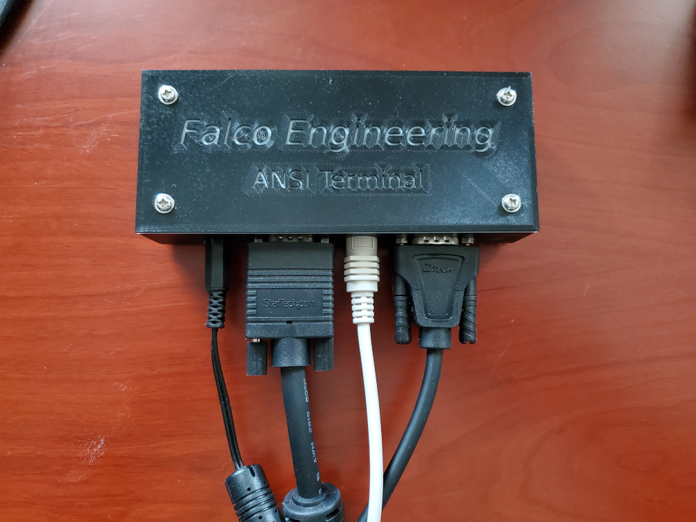
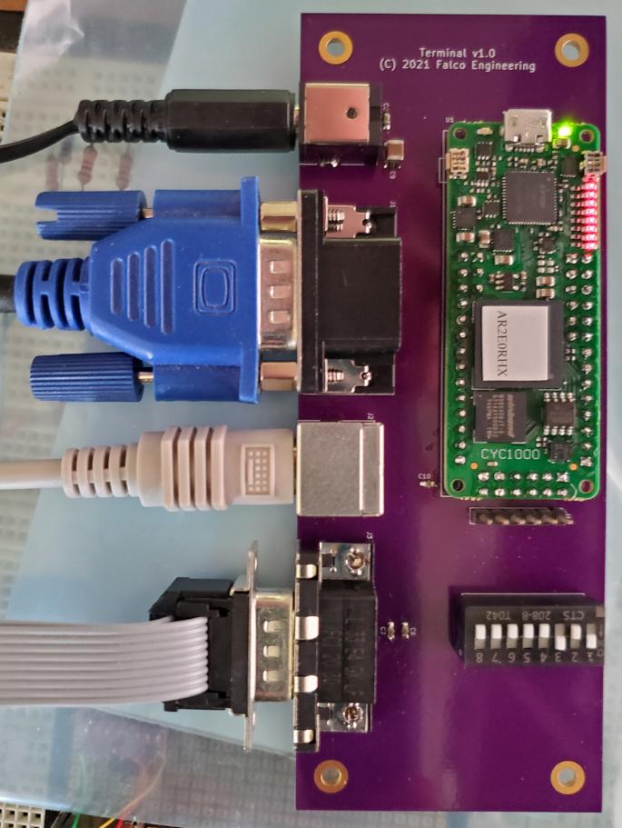
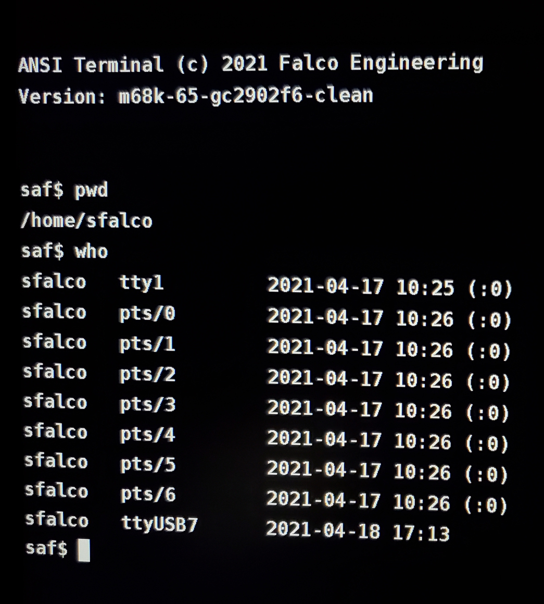

ANSI Terminal is a "dumb" terminal that emulates part of a VT100.  It is sufficient to use with vi under 2.11bsd, and it also works well as a dumb terminal for Linux.  It successfully allows editing using the "vim" editor.

Unlike many existing terminal projects, this project targets 1280x1024 monitors, which are much more common than the 640x480 monitors of days gone by.  This also allows higher quality characters, using 16x32 glyphs, rather than the more common 8x16 glyphs.

The terminals supports both hardware and software flow control, as selected by a dip switch, and baud rates from 110 to 115200 are supported.

This project contains the FPGA code and software for a CYC1000 FPGA board:

	https://www.arrow.com/en/products/cyc1000/arrow-development-tools

Both a termcap and terminfo file are provided, to enumerate the supported
escape sequences.

A companion project, ansi-terminal-kicad contains the KiCAD design files and a 3-D printable case.

Here are photos of the case, pcb, and displayed text.

ANSI Terminal

(c) 2021 Steven A. Falco

ANSI Terminal is free software: you can redistribute it and/or modify
it under the terms of the GNU General Public License as published by
the Free Software Foundation, either version 3 of the License, or
(at your option) any later version.

ANSI Terminal is distributed in the hope that it will be useful,
but WITHOUT ANY WARRANTY; without even the implied warranty of
MERCHANTABILITY or FITNESS FOR A PARTICULAR PURPOSE.  See the
GNU General Public License for more details.

You should have received a copy of the GNU General Public License
along with ANSI Terminal.  If not, see <https://www.gnu.org/licenses/>.

